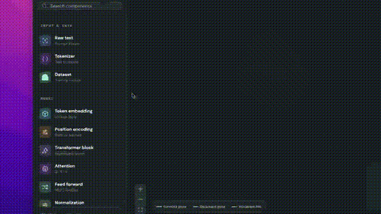

# Tensorforge

**Design an LLM training system on a canvas and see what the hardware can actually support.**

Tensorforge is an open source, browser based studio for exploring model architecture, GPU allocation, training throughput, memory, time, and cost. Drag components into a graph, load a reference model, connect GPUs to the model group, and inspect the estimates as you tune the system.

> **Educational simulator:** Tensorforge estimates training behavior. It does not train a model, benchmark a GPU, or quote live cloud prices.

## Demo



[Watch the full demo video](docs/demo.mp4)

The preview plays inline and shows a short excerpt of the full video. For a full video player directly inside GitHub's README, upload `docs/demo.mp4` in GitHub's README editor and replace this preview with the generated attachment URL on its own line. GitHub does not render repository-relative MP4 files or `<video>` tags as inline players.

## Features

- **Visual architecture editor:** Drag, connect, inspect, and resize model components on a React Flow canvas. A model group frames the architecture that GPUs can serve.
- **Reference models:** Load GPT-2 124M, Llama 3.1 8B, Mistral 7B, Gemma 2 9B, Qwen 2.5 72B, or DeepSeek-V3 671B from the top level picker. Loading a model replaces the current model, tokenizer, dataset, and graph with its saved reference configuration.
- **Connected GPU accounting:** Only GPUs connected to a group enclosing the whole model contribute capacity or cost. A disconnected GPU is ignored. Per GPU memory and utilization account for mixed device capabilities; adding a weaker GPU can become the limiting factor.
- **Live training estimates:** Explore parameters, activation and total memory, throughput, utilization, MFU, step time, training time, energy, and cost. Without a connected GPU, hardware time and cost estimates are zero. An out of memory configuration cannot produce a viable training estimate.
- **Purposeful controls:** Inspector sliders use values suited to each setting: attention heads use common head counts, vocabulary sizes move in thousands, and batch sizes, sequence lengths, prices, and hardware settings have their own steps. Exact values from model presets stay selectable.
- **Training and profiling views:** Animate forward, backward, all reduce, and optimizer phases; inspect memory, timing, parameter, comparison, and log views.
- **Portable projects:** Save locally, import and export JSON, export a report or canvas PNG, and share project state through a URL.

## Quick start

**Requirements:** Node.js 20.9+ and npm. No database, API key, hosted backend, or GPU is needed.

```bash
npm install
npm run dev
```

Open [http://localhost:3000](http://localhost:3000).

For a production build:

```bash
npm run build
npm start
```

## How to use it

1. Start with the default model or choose a reference model from the top level model picker. Selecting a reference model replaces the current canvas and entered model data.
2. Drag components from the left palette onto the canvas and connect their handles to describe the architecture.
3. Add a **Model group** from the palette. Draw or resize its rectangle so it encloses every model component.
4. Add a GPU node and connect it to the model group's bottom handle. Only then does that GPU enter capacity, utilization, time, and cost calculations. Add more connected GPUs to compare scaling or mixed hardware.
5. Use the inspector to adjust model, tokenizer, dataset, training, hardware, and distributed settings. The sliders move through setting specific steps; loaded preset values are retained exactly.
6. Run the training animation, open the profiler, or capture a comparison baseline to examine the effect of a change.

### Things to try

- Increase sequence length and watch attention memory grow.
- Compare standard attention with FlashAttention.
- Add an H100 and a smaller GPU to the same model group, then inspect each device's memory pressure.
- Disconnect one GPU and check how the available capacity and hourly cost change.
- Increase micro batch size until the configuration exceeds a device's VRAM.

## How the estimates work

The simulation is deterministic for a given configuration and seed. [`src/sim/engine.ts`](src/sim/engine.ts) calculates model parameters, precision dependent memory, attention memory, compute and bandwidth limits, throughput, parallelism overhead, energy, and cost. [`src/sim/topology.ts`](src/sim/topology.ts) determines which GPUs are connected to a complete model group. Individual GPU memory is checked against each device's VRAM.

The interface adds small visual fluctuations to live telemetry; they do not change the underlying estimate. GPU specifications and prices in [`src/data/presets.ts`](src/data/presets.ts) are editable illustrative values, not live provider data. The training animation is a visualization of estimates and does not predict model quality or convergence.

## Project layout

```text
src/
  app/                    Next.js entry point and styles
  components/
    Studio.tsx             Canvas, inspector, profiler, and interactions
    slider-stops.ts        Discrete values for numeric controls
  data/presets.ts          Reference models, GPUs, and defaults
  sim/
    engine.ts              Training and cost calculations
    topology.ts            Model group and GPU connectivity
public/                    App icons and static assets
docs/demo.gif              Inline animated demo preview
docs/demo.mp4              Full demo recording
tests/                     Simulation and slider tests
```

The UI uses [Next.js](https://nextjs.org/), [React Flow](https://reactflow.dev/), [Lucide](https://lucide.dev/), and [React Icons](https://react-icons.github.io/react-icons/). PNG export uses `html-to-image`.

## Development

```bash
npm test
npm run build
```

To add a reference model or accelerator, edit [`src/data/presets.ts`](src/data/presets.ts). To change a slider's values, edit [`src/components/slider-stops.ts`](src/components/slider-stops.ts). Keep estimate changes in the simulation modules so they can be tested independently of the UI.

Contributions are welcome. Include a clear description of the behavior you changed and run the checks above before opening a pull request.

## License

A license has not been selected yet. Until one is added, the repository does not grant reuse rights beyond those provided by law.
